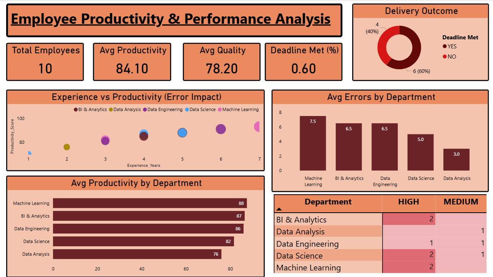

# Employee Productivity & Performance Analysis | Power BI

## Project Overview
This project analyzes employee productivity and performance across teams, departments, and experience levels. The original dataset was sourced from Kaggle and then modified and enriched by adding error-related, quality, and project complexity metrics to enable deeper performance analysis.

An interactive Power BI dashboard was built using basic DAX measures to track productivity, quality, errors, and deadline adherence.

## Tools & Technologies
- Power BI Desktop  
- DAX (Basic Measures)  
- Microsoft Excel  
- Git & GitHub  

## Dataset Details
Original Source: Kaggle (Employee Productivity dataset)

### Dataset Enhancements Performed
The dataset was cleaned and enhanced by adding the following columns:

- Errors_Made – Number of errors committed by employees  
- Error_Severity – Categorized error impact (High / Medium)  
- Quality_Score – Quality performance score of work delivered  
- Project_Complexity – Complexity level of assigned projects (High / Medium / Low)  
- Team_Name – Team classification (Alpha, Beta, Gamma, Delta)  
- Deadline_Met – Indicates whether project deadlines were met (Yes / No)

### Files Included
- employee_productivity.csv – Raw dataset  
- employee_productivity_enriched.xlsx – Cleaned and enhanced dataset used in Power BI  

## DAX Measures Used
Basic DAX measures were created to calculate:

- Total Employees  
- Average Productivity  
- Average Quality Score  
- Deadline Met Percentage  
- Average Errors by Department  

These measures enable quick performance evaluation across teams and departments.

## 📈 Dashboard Highlights
The Power BI dashboard includes:

### KPI Cards
- Total Employees  
- Average Productivity  
- Average Quality  
- Deadline Met (%)  

### Analytical Visuals
- Experience vs Productivity (Error Impact) – Shows how experience and error severity affect productivity  
- Average Errors by Department – Identifies departments with higher error impact  
- Average Productivity by Department – Compares productivity across teams  
- Delivery Outcome Analysis – Visual breakdown of deadlines met vs not met  

## Key Insights
- Higher experience generally leads to higher productivity, but error severity impacts output quality  
- Teams handling high-complexity projects tend to show higher error severity  
- Data Science and Machine Learning teams demonstrate stronger productivity performance  
- Deadline adherence is closely linked with error severity and project complexity  

## Dashboard Preview

## How to Use This Project
1. Download the .pbix file from the repository  
2. Open it using Power BI Desktop  
3. Refresh the dataset if required  
4. Explore interactive visuals and insights  

## Disclaimer
This project is created for learning and portfolio purposes. The dataset is based on publicly available data from Kaggle and has been modified to demonstrate analytical, data modeling, and visualization skills.

## Author
Akanksha Shukla  
Aspiring Data Analyst | Power BI | Tableau | Excel | SQL | GitHub
